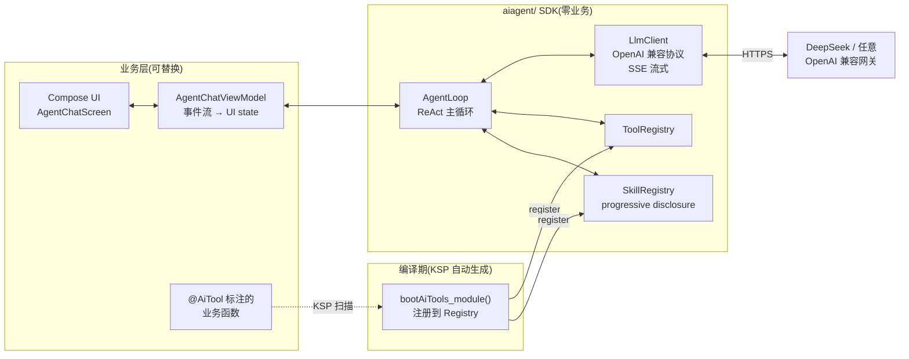

# androidAIAgent

一个**可独立移植**的 Android AI Agent SDK + 一个最小可跑通的 Demo App。

挂上 `@AiTool` 注解,你的 Kotlin 函数就能被大模型在本地调用 —— 不需要写 prompt
模板、不用维护 tool 注册表、不用手撸 OpenAI 协议解析。一切由 KSP 编译期生成 +
SDK 运行期托管。

## 目录结构

```
androidAIAgent/
├── aiagent/                  ← 真正想抄走的 SDK,跟项目零耦合
│   ├── lib_ai_annotations/   注解契约 + Runtime 接口
│   ├── lib_ai_compiler/      KSP 处理器,扫 @AiTool / @AiSkill 生成注册代码
│   └── lib_ai_agent_sdk/     运行时:AgentLoop / LLM 客户端 / Skill / Tool
│
└── app/                      ← Demo:演示 SDK 如何接入
    └── com.zhangz.androidaiagent.demo
        ├── tools/            DemoTools.kt:三个示例工具
        ├── config/           AgentConfig.kt:DeepSeek profile 装配
        ├── bootstrap/        AgentBootstrap.kt:统一入口
        └── ui/               Compose 聊天 UI(可整体抄)
```

## 架构



## 5 分钟跑通 Demo

1. **填 key**:打开仓库根 `local.properties`(已 git-ignored,**永远不会进 git**),
   把 `ai.deepseek.key=` 那行的注释打开,粘上你的 [DeepSeek API key](https://platform.deepseek.com/)。
2. **同步工程**:Android Studio 打开本目录,`File → Sync Project with Gradle Files`。
3. **跑起来**:连真机或模拟器,直接 Run `app`。
4. 入口页点「打开 AI 助手」→ 输入「现在几点?」→ 模型会调 `device_time` 工具,把 UTC 时间放在气泡里返回。
5. 试试「弹个 Toast 说你好」→ 走 `show_toast`;再试「清空历史」→ 会先弹**确认对话框**,这是 `requiresConfirmation = true` 的演示。

### 换一家 LLM provider

SDK 已经把「OpenAI 兼容协议 + 可选自定义 header / body」的差异收敛到
`LlmProviderProfile`,所以**换 provider 就是换一个 profile**。两条路:

**A. 默认 DeepSeek 之外的内置 profile**:在 `DemoApp.onCreate` 里给 `AgentConfig`
注入,**必须在第一次访问 `AgentBootstrap.llmClient` 之前设**(lazy 单例只构造一次):

```kotlin
AgentConfig.profileOverride = LlmProviderProfile.siliconFlow(
    baseUrl = "https://api.siliconflow.cn",
    apiKey  = "sk-...",
    model   = "deepseek-ai/DeepSeek-V3",
)
```

**B. 自部署 / 公司内网 / 或者任何需要额外 header 的网关**:用最底层的
`LlmProviderProfile(...)` 自己写一个 `decorate` lambda,SDK 会在每次发请求前调一次:

```kotlin
AgentConfig.profileOverride = LlmProviderProfile(
    provider = LlmProvider.CUSTOM_GATEWAY,        // 任选一个最贴近的枚举
    baseUrl  = "https://your-gateway.example.com",
    apiKey   = "...",
    model    = "deepseek-chat",
    decorate = { reqBuilder, body ->
        val traceId = UUID.randomUUID().toString()
        reqBuilder.addHeader("trace_id", traceId) // 网关要求的额外头
        body.put("rid", traceId)                  // 网关要求的额外 body 字段
    },
)
```

> 想把 baseUrl / key / model 也搬出 git?把它们写进 `local.properties`,
> 在 `app/build.gradle.kts` 加 `buildConfigField` 透传到代码里读 BuildConfig 即可
> ——参考已有的 `ai.deepseek.*` 那一组的写法。

> baseUrl 是 `http://`(自部署 / 内网网关常见)时,Android 9+ 会拦明文流量。
> Demo 已在 `app/src/main/res/xml/network_security_config.xml` 全局放行 cleartext
> 并在 manifest 引用,需要收紧时改成 per-domain `<domain-config>` 白名单即可。

## 无 UI 触发(adb headless)

调试 / 自动化场景下不想点 UI?装上 debug 包后,直接用 adb 派任务:

```bash
# 默认安全:危险工具(requiresConfirmation=true)一律拒绝
adb shell am start -a com.zhangz.androidaiagent.HEADLESS \
    -e task "现在几点"

# 显式放行危险工具
adb shell am start -a com.zhangz.androidaiagent.HEADLESS \
    -e task "清空演示历史" \
    --ez allowDangerous true

# 预加载 skill,省一轮 list_skills/load_skill
adb shell am start -a com.zhangz.androidaiagent.HEADLESS \
    -e task "用 toast 弹一句你好" \
    -e loadSkills "demo"

# 看反馈(任务派单 / 每轮 / 完成 / 失败,以及 SDK 自身日志)
adb logcat -s AiAgent_Headless,AiAgent_Loop,AiAgent_Req,AiAgent_Resp
```

| Intent extra | 类型 | 说明 |
|---|---|---|
| `task` | String,必填 | 任务描述,空串会被 reject |
| `allowDangerous` | Boolean,默认 false | 放行 `requiresConfirmation=true` 的工具 |
| `loadSkills` | String,默认空 | 逗号分隔的 skill id,启动前预加载 |

实现:`HeadlessAgentActivity`(`Theme.NoDisplay` + `onCreate` 立即 `finish`)→
`AgentBootstrap.runHeadless`(ApplicationScope 跑 AgentLoop,Activity 销毁不影响)→
`HeadlessReporter`(logcat + Toast)。仅 `BuildConfig.DEBUG` 真正执行,release 包
进入即 finish;真要彻底隔离可把 manifest 那条 activity 搬到 `app/src/debug/`。

## 30 秒加一个工具

在你自己的 Android 模块里挑一个 `object`,挂注解就完事:

```kotlin
@AiSkill(id = "navigation", name = "页面跳转")
object NavigationAi {

    @AiTool(description = "跳转到指定 URI 的内部页")
    suspend fun openUri(uri: String): String {
        // 你的真实业务 ...
        return "ok"
    }
}
```

KSP 会在 `app/build/generated/ksp/.../AiToolsBoot_<bootName>.kt` 生成一个
`bootAiTools_<bootName>()` 函数,启动时调一次,工具就接上了。约束:

- **必须 `object` + `suspend`**(单例 + 协程,SDK 这样才能零反射调用);
- **参数仅基础类型**(`String / Int / Long / Boolean / Double / Float`),复杂入参建议拆分;
- **返回 `String`**(返回给模型看的内容,纯文本即可)。

详细规则、Skill 用法、KSP 注意事项 → [`aiagent/README.md`](aiagent/README.md)。

## 接入到自己的工程

复制三件套即可:

```
你的工程/
├── aiagent/lib_ai_annotations/    ← 整个目录复制
├── aiagent/lib_ai_compiler/       ← 整个目录复制
└── aiagent/lib_ai_agent_sdk/      ← 整个目录复制
```

然后在自己业务模块的 `build.gradle.kts` 里:

```kotlin
plugins { alias(libs.plugins.ksp) }

ksp { arg("aiagent.bootName", "myModule") }   // 决定生成函数名后缀

dependencies {
    implementation(project(":aiagent:lib_ai_agent_sdk"))
    implementation(project(":aiagent:lib_ai_annotations"))
    kspDebug(project(":aiagent:lib_ai_compiler"))
}
```

最后参考 [`app/.../bootstrap/AgentBootstrap.kt`](app/src/main/java/com/zhangz/androidaiagent/demo/bootstrap/AgentBootstrap.kt)
照搬一份 80 行的入口即可。

## 工具链

| 项 | 版本 |
|---|---|
| Gradle | 8.14.3 |
| Android Gradle Plugin | 8.11.2 |
| Kotlin | 2.2.0 |
| KSP | 2.2.0-2.0.2 |
| compileSdk / minSdk | 35 / 24 |

## 进一步阅读

- [`aiagent/README.md`](aiagent/README.md) — SDK 接入完整说明
- [`aiagent/lib_ai_agent_sdk/README.md`](aiagent/lib_ai_agent_sdk/README.md) — Runtime 内部设计
- [`aiagent/lib_ai_compiler/README.md`](aiagent/lib_ai_compiler/README.md) — KSP 处理器细节
